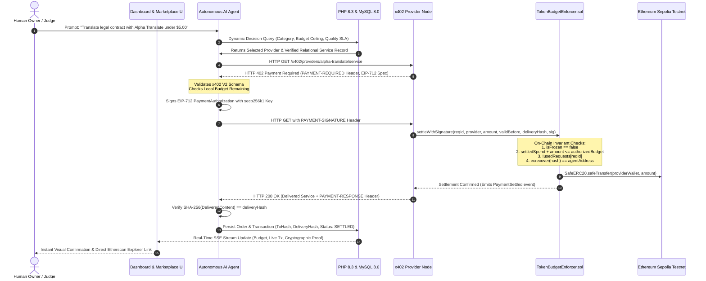

# W3A-1: Autonomous Machine Payments (x402 V2)

<p align="center">
  
  
  
  
  
  
  
  
</p>

> **"Let AI Agents Buy Services Safely"** — An enterprise-grade, cryptographically verifiable autonomous agent payment network.  
> Combines the **Coinbase x402 V2 HTTP Wire Protocol**, **EVM Smart Contract Budget Enforcers**, **PHP 8.3 & MySQL 8.0 Relational Persistence**, and **Ethereum Sepolia On-Chain Settlement** to eliminate financial hallucination and wallet-drain vulnerabilities.

---

### 🌐 Live Production Deployments
* **Owner Control Center (Dashboard)**: [https://rishisharma029.github.io/w3a-1/](https://rishisharma029.github.io/w3a-1/)
* **Autonomous AI Marketplace**: [https://rishisharma029.github.io/w3a-1/marketplace/](https://rishisharma029.github.io/w3a-1/marketplace/)
* **Cryptographic Receipt & Proof Verifier**: [https://rishisharma029.github.io/w3a-1/verify.html](https://rishisharma029.github.io/w3a-1/verify.html)
* **n8n Cloud Webhook Gateway**: `https://rishisharma029.app.n8n.cloud/webhook/w3a1/purchase`
* **Sepolia Enforcer Contract**: [`0xf9f296e97062F49ad3d13aF96729F7c35a7eA75e`](https://sepolia.etherscan.io/address/0xf9f296e97062F49ad3d13aF96729F7c35a7eA75e)
* **Sepolia MockUSDC Token**: [`0xAaa008Df25A46dc501B5B712ac18B47901AF99A7`](https://sepolia.etherscan.io/address/0xAaa008Df25A46dc501B5B712ac18B47901AF99A7)

---

## 1. The Core Problem & The W3A-1 Solution

### The Dilemma
As autonomous AI agents take over complex tasks (code analysis, automated research, dataset synthesis), they require access to commercial APIs and decentralized microservices. However, giving an LLM direct control of a Web3 private key creates catastrophic attack vectors:
1. **Model Hallucination**: AI can loop requests or sign arbitrary transactions.
2. **Prompt Injection / Jailbreak**: Malicious prompts trick the agent into paying exorbitant rates or draining escrow balances.
3. **Zero Cryptographic Accountability**: Traditional REST APIs cannot guarantee that delivered data corresponds to settled funds.

### The W3A-1 Standard: Separation of Decision and Enforcement
W3A-1 introduces strict separation of powers:

$$\text{Decision Layer (AI + SQL)} \neq \text{Enforcement Layer (Smart Contract)}$$

```
┌────────────────────────────────────────────────────────────────────────────────────────┐
│                                   W3A-1 ARCHITECTURE                                   │
└────────────────────────────────────────────────────────────────────────────────────────┘

    [ HUMAN OWNER ]                 [ AI AGENT ]              [ DECENTRALIZED MARKET ]
           │                              │                              │
    Deposits Escrow Funds                 │                              │
    Sets Authorized Budget                │                              │
    Retains EMERGENCY FREEZE              │                              │
           │                              │                              │
           ▼                              │                              │
  ┌──────────────────┐                    │                              │
  │   SMART CONTRACT │                    │                              │
  │  TokenBudget     │                    │                              │
  │   Enforcer.sol   │                    │                              │
  └────────┬─────────┘                    │                              │
           │                              │                              │
           │  1. Discovers & Evaluates   │                              │
           │     via PHP 8.3 & MySQL 8.0  │                              │
           │     Pareto Frontier Query    ├─────────────────────────────►│ (53 Services Across
           │                              │                              │  14 Provider Nodes)
           │                              │                              │
           │  2. HTTP GET /service        │                              │
           │     ─────────────────────────┼─────────────────────────────►│
           │                              │  HTTP 402 PAYMENT-REQUIRED   │
           │                              │◄─────────────────────────────┤ (x402 V2 Challenge)
           │                              │                              │
           │  3. Signs EIP-712 Auth       │                              │
           │     within Authorized Cap    │                              │
           │                              │  HTTP 200 + PAYMENT-SIGNATURE│
           │                              │─────────────────────────────►│
           │                              │                              │
           │  4. Broadcasts Settlement    │                              │
           │◄─────────────────────────────┼──────────────────────────────┤
           │                              │                              │
  [ ON-CHAIN VERIFICATION ]               │                              │
  • Checks remainingBudget >= amount      │                              │
  • Checks !isFrozen                      │                              │
  • Checks !_usedRequests[reqId]          │                              │
  • Verifies EIP-712 ECDSA signature      │                              │
  • SafeERC20.transfer(provider, amount)  │                              │
  • Binds deliveryHash into event logs    │                              │
           │                              │                              │
           ▼                              │  5. Delivers Paid Content    │
  [ SETTLED ON SEPOLIA ] ────────────────┼─────────────────────────────►│ (Verified Content)
                                          │                              │
                                          ▼                              ▼
                             [ CLIENT SHA-256 CHECK ]       [ MYSQL PERSISTENCE ]
                             Independent Hash Validation    Orders & Transactions Logged
```

---

## 2. Complete End-to-End System Workflow



---

## 3. Technology Stack & Architectural Matrix

| Layer | Technologies | Responsibilities |
|:---|:---|:---|
| **Smart Contracts** | **Solidity 0.8.24**, OpenZeppelin Contracts, Hardhat | On-chain budget enforcement (`TokenBudgetEnforcer.sol`), EIP-712 verification, emergency pause, `MockUSDC.sol` (6 decimals), SafeERC20. |
| **Blockchain Network** | **Ethereum Sepolia Testnet** (`eip155:11155111`), Local EVM (`eip155:31337`) | Real transaction mining, trustless token settlement, immutable event logs, Etherscan telemetry. |
| **Payment Protocol** | **Coinbase x402 V2** (`@x402/core@2.25.0`, `@x402/evm@0.6.2`) | Standardized HTTP wire format: `PAYMENT-REQUIRED`, `PAYMENT-SIGNATURE`, `PAYMENT-RESPONSE` headers. |
| **Relational Database** | **MySQL 8.0 (InnoDB Engine)** | Normalized relational schema: `services`, `providers`, `categories`, `orders`, `transactions`, `reviews`, `users`. |
| **Backend Microservice** | **PHP 8.3 (PDO MySQL)** | High-speed REST API, Pareto Frontier SQL decision engine, parameter-bound query security. |
| **Application Gateway** | **Node.js v20+**, Express, Axios, Ethers.js v6 | Orchestration bridge, SSE telemetry streaming, x402 proxy facilitator. |
| **Autonomous Workflow** | **n8n Cloud Webhook Orchestration** | 11-stage autonomous purchasing pipeline, webhook trigger, agent telemetry ingest. |
| **Frontend HUD** | **HTML5, CSS3, Vanilla ES6+ JavaScript** | Cyber HUD design, reactive state management, Zero-page-reload SSE stream, cryptographic verifier. |

---

## 4. Persistent Relational Layer: MySQL 8.0 & PHP 8.3

W3A-1 replaces volatile mock configurations with a fully normalized, relational database architecture running on **MySQL 8.0 (InnoDB)** and queried through a **PHP 8.3** microservice.

```
┌────────────────────────────────────────────────────────────────────────────────────────┐
│                        MYSQL 8.0 RELATIONAL DATABASE SCHEMA                            │
└────────────────────────────────────────────────────────────────────────────────────────┘

    ┌─────────────────┐       ┌─────────────────┐       ┌─────────────────┐
    │   categories    │       │    providers    │       │      users      │
    ├─────────────────┤       ├─────────────────┤       ├─────────────────┤
    │ id (PK)         │◄──┐   │ id (PK)         │◄──┐   │ id (PK)         │◄──┐
    │ name            │   │   │ name            │   │   │ name            │   │
    │ description     │   │   │ rating          │   │   │ wallet_address  │   │
    └─────────────────┘   │   │ quality_score   │   │   │ role            │   │
                          │   │ endpoint        │   │   └─────────────────┘   │
                          │   └─────────────────┘   │                         │
                          │            ▲            │                         │
                          │            │            │                         │
                   ┌──────┴────────────┴────┐       │                         │
                   │        services        │       │                         │
                   ├────────────────────────┤       │                         │
                   │ id (PK)                │       │                         │
                   │ provider_id (FK)       │       │                         │
                   │ category_id (FK)       │       │                         │
                   │ name                   │       │                         │
                   │ price                  │       │                         │
                   │ quality_score          │       │                         │
                   │ delivery_time          │       │                         │
                   │ availability           │       │                         │
                   └────────────────────────┘       │                         │
                               ▲                    │                         │
                               │                    │                         │
                   ┌───────────┴────────────────────┴─────────────────────────┴┐
                   │                          orders                           │
                   ├───────────────────────────────────────────────────────────┤
                   │ id (PK)                                                   │
                   │ user_id (FK)                                              │
                   │ service_id (FK)                                           │
                   │ provider_id (FK)                                          │
                   │ amount                                                    │
                   │ status (SETTLED)                                          │
                   │ delivery_hash (VARCHAR 255)                               │
                   │ payload_input                                             │
                   │ payload_output                                            │
                   └─────────────────────────────┬─────────────────────────────┘
                                                 │
                                                 ▼
                   ┌───────────────────────────────────────────────────────────┐
                   │                       transactions                        │
                   ├───────────────────────────────────────────────────────────┤
                   │ id (PK)                                                   │
                   │ order_id (FK)                                             │
                   │ transaction_reference (Sepolia TxHash UNIQUE)             │
                   │ amount                                                    │
                   │ status (SETTLED)                                          │
                   │ block_number                                              │
                   │ network (Ethereum Sepolia Testnet)                        │
                   │ etherscan_url                                             │
                   └───────────────────────────────────────────────────────────┘
```

### 53 AI Services Across 14 Provider Nodes & 9 Categories
Rather than a toy list of 3 items, the marketplace operates at realistic commercial scale:
* **AI Services**: Text Generation, Legal Translation, Multi-Language Localization, Summarization, Code Analysis, AI Research.
* **Vision & Media**: Neural OCR, Image Upscaling, Facial Landmark Detection, Video Transcoding.
* **Data & Compute**: Vector Embeddings, RAG Knowledge Base Retrieval, BigData Clustering, High-Performance GPU Compute.
* **Security & Auditing**: Smart Contract Static Analysis, Transaction Threat Scanning, Anti-Phishing Verification.
* **Speech & Audio**: Neural Speech-to-Text, Voice Synthesis, Acoustic Noise Reduction.

### Live Dynamic Pareto Frontier SQL Selection Engine
When the autonomous agent evaluates which provider to select, it executes a live Pareto optimization query against MySQL:

```sql
SELECT s.*, 
       p.name AS provider_name, 
       p.rating AS provider_rating, 
       p.quality_score AS provider_quality
FROM services s
JOIN providers p ON s.provider_id = p.id
WHERE s.category_id = :category_id
  AND s.price <= :budget
  AND s.availability = 1
  AND s.quality_score >= :min_quality
ORDER BY p.rating DESC, s.price ASC
LIMIT 5;
```

---

## 5. Mathematical Proof & Provable Smart Contract Invariants

The `TokenBudgetEnforcer.sol` smart contract enforces **seven immutable mathematical invariants** on the EVM:

| Invariant | Mathematical Formulation | Enforcement Mechanism |
|:---|:---|:---|
| **$I_1$: Spending Ceiling** | $\sum \text{SettledSpend} + \Delta \le \text{AuthorizedBudget}$ | Smart contract reverts if current spend exceeds authorized budget. Reverts with **$0 tokens moved**. |
| **$I_2$: Anti-Replay** | $\forall \text{reqId}: \text{Count}(\text{Settled}) \le 1$ | `mapping(bytes32 => bool) _usedRequests` permanently records every request ID. Replays revert. |
| **$I_3$: Cryptographic Binding** | $\text{Recover}(\text{hash}, \text{sig}) = \text{AgentAddress}$ | EIP-712 Typed Data hashes `(reqId, provider, amount, validBefore)`. Signature alteration reverts. |
| **$I_4$: Owner Authority** | $\text{isFrozen} \implies \Delta = 0$ | Emergency freeze modifier `whenNotFrozen` instantly halts all contract payouts. |
| **$I_5$: Escrow Solvency** | $\text{ContractBalance}(\text{USDC}) \ge \text{AuthorizedBudget} - \text{SettledSpend}$ | Escrow holds physical tokens funded by owner before agent can authorize payments. |
| **$I_6$: Delivery Binding** | $\text{keccak256}(\text{delivery}) = \text{DeliveryHash}_{\text{on-chain}}$ | On-chain settlement requires immutable delivery hash logged to blockchain receipt. |
| **$I_7$: Reentrancy Immunity** | $\text{State}_{\text{unlocked}} \to \text{State}_{\text{locked}} \to \text{State}_{\text{unlocked}}$ | OpenZeppelin `ReentrancyGuard` applied on all state-modifying functions. |

---

## 6. Official x402 V2 Protocol Compliance

W3A-1 is built on the official Coinbase x402 V2 specification (`@x402/core@2.25.0`):

```http
HTTP/1.1 402 Payment Required
Content-Type: application/json
PAYMENT-REQUIRED: eyJ4NDAyVmVyc2lvbiI6MiwiZXJyb3IiOiJQYXltZW50IFJlcXVpcmVkIiw...

{
  "x402Version": 2,
  "error": "Payment Required",
  "accepts": [
    {
      "scheme": "exact",
      "network": "eip155:11155111",
      "asset": "0xAaa008Df25A46dc501B5B712ac18B47901AF99A7",
      "amount": "4000000",
      "payTo": "0x3C44CdDdB6a900fa2b585dd299e03d12FA4293BC",
      "maxTimeoutSeconds": 300,
      "extra": {
        "reqId": "0x4b2c1f938d874ab281295cb283f124c800000000000000000000000000000000"
      }
    }
  ]
}
```

* **Wire Strictness**: Tested against native `globalThis.fetch()` with pure HTTP headers (`PAYMENT-REQUIRED`, `PAYMENT-SIGNATURE`, `PAYMENT-RESPONSE`).
* **Integer Atomic Units**: Values encoded as decimal strings (`4000000` = $4.000000 USDC) to prevent float-rounding exploits.
* **CAIP-2 Identifiers**: Strict format `eip155:11155111` (Sepolia) and `eip155:31337` (Local EVM).

---

## 7. Automated Test Suite (169 Tests Passing)

W3A-1 is verified by an exhaustive 15-suite automated test matrix covering smart contracts, x402 wire compliance, adversarial attack vectors, and multi-turn purchase flows:

```
================================================================================
                    W3A-1 COMPREHENSIVE TEST SUITE MATRIX
================================================================================
 PASS  test/contract/BudgetEnforcer.test.js           (33 tests) [Unit Contract]
 PASS  test/integration/flow.test.js                   (7 tests) [HTTP 402 Handshake]
 PASS  test/phase2/discovery.test.js                   (8 tests) [Capability Discovery]
 PASS  test/phase2/selection.test.js                   (7 tests) [Ranking & Selection]
 PASS  test/phase2/flow.test.js                        (6 tests) [Multi-Turn Purchasing]
 PASS  test/phase2/adversarial.test.js                 (9 tests) [Fault Injection]
 PASS  test/phase3/token-budget.test.js                (8 tests) [ERC-20 Escrow Accounting]
 PASS  test/phase3/eip712-authorization.test.js        (7 tests) [EIP-712 Signatures]
 PASS  test/phase3/settlement.test.js                  (8 tests) [Settlement Payouts]
 PASS  test/phase3/x402-flow.test.js                   (7 tests) [End-to-End Token Flow]
 PASS  test/phase4/x402-protocol.test.js              (12 tests) [Wire Specification]
 PASS  test/phase4/malicious-agent.test.js             (8 tests) [Agent Attack Defense]
 PASS  test/phase4/malicious-provider.test.js          (9 tests) [Provider Attack Defense]
 PASS  test/phase4/invariants.test.js                 (10 tests) [Formal Mathematical Proofs]
 PASS  test/phase5/x402-real.test.js                  (30 tests) [Official @x402/core V2]
--------------------------------------------------------------------------------
 TOTAL: 169 Tests Passing | 0 Failing | 100% Invariants Verified
================================================================================
```

### End-to-End Product Integration Suite
Run the 18-step full system integration test covering live discovery, selection, n8n orchestration, x402 wire negotiation, Sepolia settlement, delivery verification, and overspend defense:

```bash
node scripts/test-product-integration.js
```
```
✔ ALL 18/18 ACCEPTANCE CRITERIA PASSING! PRODUCT INTEGRATION COMPLETE.
```

---

## 8. Quick Start Guide (Run Locally in 60 Seconds)

### Step 1: Clone & Install Dependencies
```bash
git clone https://github.com/Rishisharma029/w3a-1.git
cd w3a-1
npm install
```

### Step 2: Configure Environment
Copy the pre-configured template (no secret keys required for local operation):
```bash
cp .env.example .env
```

### Step 3: Launch Local Full-Stack Environment
Our self-healing orchestrator boots all services with a single command:
```bash
npm run start:local
```
This boots:
* **Local Hardhat EVM** on port `8545` (deploys `MockUSDC` & `TokenBudgetEnforcer`)
* **MySQL 8.0 & PHP 8.3 API** on port `8088` (database `w3a1_marketplace`)
* **x402 Token Marketplace** on port `14210`
* **Owner Control Center Dashboard** on port `14300`

### Step 4: Run Demos & Test Suites
```bash
# Run official 10-step x402 V2 Judge Demo
npm run demo:x402

# Run Phase 4 Security Hardening Suite (10 adversarial attacks proven blocked)
npm run demo4

# Run all 169 unit & integration tests
npm run test:all
```

---

## 9. Security & Trust Boundaries

W3A-1 enforces a clear boundary between **off-chain untrusted components** and **on-chain trustless guarantees**:

```
┌────────────────────────────────────────────────────────────────────────┐
│             OFF-CHAIN COMPONENTS (Untrusted Application Layer)         │
│   • AI Agent LLM Reasoning & Prompt Interpretation                     │
│   • Service Marketplace Discovery Catalog                              │
│   • Provider Node Delivery of API Results                              │
│   • PHP / Node.js Express Gateway Proxies                              │
│   [Vulnerabilities here CANNOT compromise user funds]                  │
└───────────────────────────────────┬────────────────────────────────────┘
                                    │ EIP-712 Signed Authorization
                                    ▼
┌────────────────────────────────────────────────────────────────────────┐
│             ON-CHAIN COMPONENTS (Trustless Protocol Layer)             │
│   • TokenBudgetEnforcer.sol (EVM Contract)                            │
│   • Hard authorized budget ceiling check (Reverts on overspend)        │
│   • One-time nonce anti-replay registry                                │
│   • Emergency freeze switch instantly controlled by owner              │
│   • SafeERC20 escrow release to provider wallet                        │
│   [Funds are mathematically and cryptographically protected]          │
└────────────────────────────────────────────────────────────────────────┘
```

For full threat model, vulnerability disclosures, and security guidelines, see [`SECURITY.md`](SECURITY.md).

---

## 10. Repository File Structure

```
├── contracts/                        # Core Solidity Smart Contracts
│   ├── TokenBudgetEnforcer.sol       # Authoritative spending enforcer with EIP-712 & freeze
│   ├── MockUSDC.sol                  # 6-decimal ERC-20 token for escrow settlement
│   └── BudgetEnforcer.sol            # Phase 1 foundation contract
├── marketplace/                      # Persistent Marketplace & x402 Providers
│   ├── php/                          # PHP 8.3 RESTful API & Relational Database Layer
│   │   ├── schema.sql                # MySQL 8.0 InnoDB schema (7 relational tables)
│   │   ├── db.php                    # PDO connection bootstrapper
│   │   ├── seed.php                  # Relational seeder (53 services, 14 nodes, 9 categories)
│   │   └── api.php                   # REST API & dynamic Pareto Frontier SQL decision engine
│   ├── public/                       # Standalone Marketplace web interface
│   ├── token-server.js               # Multi-provider x402 settlement Express server
│   ├── x402-provider-router.js       # Official x402 V2 router (/x402/providers/:id/service)
│   └── providers.js                  # Provider registry & capability definitions
├── dashboard/                        # Human Owner Control Center
│   ├── server.js                     # Telemetry aggregator, SSE stream, Sepolia bridge
│   └── public/                       # Real-time dashboard UI, transaction feeds, threat logs
├── orchestrator/                     # Cloud Workflow Orchestration
│   └── n8n-connector.js              # Full integration bridge for n8n autonomous purchasing
├── agent/                            # Autonomous AI Agent Reasoning & Execution
│   ├── llm-client.js                 # Gemini 1.5-flash parser & deterministic fallback
│   ├── provider-selector.js          # Heuristic multi-criteria ranking algorithm
│   └── x402-payment-client.js        # Official x402 client with EIP-712 signer
├── facilitator/                      # Payment Verification & Settlement Engine
│   └── facilitator.js                # Official x402 V2 PaymentFacilitator
├── services/                         # Testnet Integration
│   └── sepolia-settler.js            # Real Ethereum Sepolia settlement engine & Etherscan logger
├── scripts/                          # Automated Runners & Full-Stack Orchestration
│   ├── start-localhost.js            # Master local stack orchestrator
│   ├── start-mysql-php.js            # Self-healing MySQL 8.0 & PHP 8.3 background launcher
│   ├── test-product-integration.js   # 18-step product integration test suite
│   ├── deploy-phase3.js              # EVM contract deployment script
│   └── verify-sepolia.js             # Sepolia testnet verification tool
├── docs/                             # GitHub Pages Documentation & Live Explorer
│   ├── index.html                    # Live Owner Control Center mirror
│   ├── marketplace/                  # Live Marketplace mirror
│   └── verify.html                   # Cryptographic receipt verification portal
├── test/                             # 15 Test Suites (169 Automated Tests)
├── X402.md                           # Comprehensive x402 V2 Protocol Analysis
├── SECURITY.md                       # Formal Threat Model & Trust Boundaries
├── CONTRIBUTING.md                   # Development & Pull Request Guidelines
├── CODE_OF_CONDUCT.md                # Contributor Covenant Code of Conduct
└── LICENSE                           # MIT Open Source License
```

---

## 11. License & Community

This project is licensed under the **MIT License** — see the [`LICENSE`](LICENSE) file for details.  
Community participation is governed by our [`CODE_OF_CONDUCT.md`](CODE_OF_CONDUCT.md).

---

<p align="center">
  <b>W3A-1: Autonomous Machine Payments (x402 V2)</b><br/>
  <i>The AI can choose. The AI cannot override the protocol.</i>
</p>
