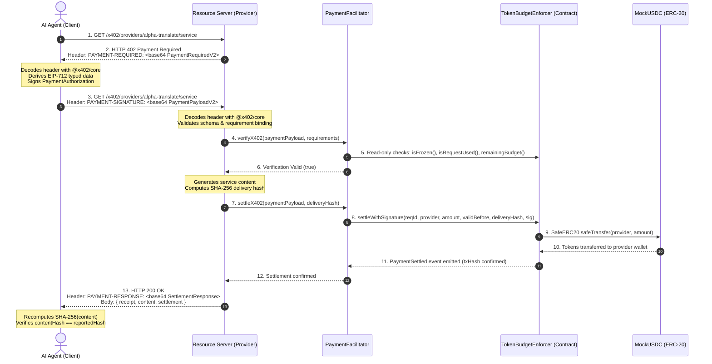

# W3A-1: Official x402 V2 Protocol Integration

> **Implementation Standard:** x402 V2 Implementation for EVM Exact Payments  
> **Official SDK Package:** `@x402/core@2.25.0` & `@x402/evm@2.25.0`  
> **Network:** CAIP-2 `eip155:31337` (Local EVM) / `eip155:11155111` (Ethereum Sepolia)  
> **Core Guarantee:** AI Decides → x402 Negotiates → Smart Contract Enforces → SafeERC20 Settles

---

## 1. What is x402?

x402 is an open internet-native standard that unlocks the reserved **HTTP 402 "Payment Required"** status code to enable autonomous machine-to-machine micropayments for APIs and web services. Originally created by Coinbase and now governed by the x402 Foundation, it provides a standardized handshake protocol where clients and resource servers negotiate payment terms directly over HTTP headers without accounts, API keys, or subscriptions.

---

## 2. Which x402 Version is Implemented?

W3A-1 implements **x402 V2** (`x402Version: 2`).

### Key Differences Between V1 and V2
| Protocol Element | x402 V1 | x402 V2 (W3A-1 Implementation) |
|---|---|---|
| **Version Identifier** | `x402Version: 1` | `x402Version: 2` |
| **Payment Challenge Header** | `X-PAYMENT-REQUIRED` | `PAYMENT-REQUIRED` |
| **Client Payment Header** | `X-PAYMENT` | `PAYMENT-SIGNATURE` |
| **Server Settlement Header** | `X-PAYMENT-RESPONSE` | `PAYMENT-RESPONSE` |
| **Network Identifier** | Arbitrary string (`base-sepolia`) | CAIP-2 format (`eip155:31337`, `eip155:11155111`) |
| **Amount Representation** | `maxAmountRequired` | `amount` (atomic token units string) |
| **Schema Validation** | Custom / loose string | Official `@x402/core` Zod schemas (`PaymentRequiredV2Schema`, `PaymentPayloadV2Schema`) |
| **Wire Encoding** | JSON or Base64 | Base64-encoded UTF-8 JSON |

---

## 3. Exact Payment Scheme

W3A-1 implements the **`exact`** scheme:
- **Scheme Name:** `"exact"`
- **Asset Type:** ERC-20 (`MockUSDC` with 6 decimals)
- **Amount Specification:** String representing atomic token units (`4000000` = $4.00 USDC)
- **Settlement Behavior:** Exactly transfers the authorized amount; no streaming, no over-drawing, no uncollateralized balances.

---

## 4. HTTP Wire Flow



---

## 5. PaymentRequired Structure (V2)

Generated by the resource server on HTTP 402:

```json
{
  "x402Version": 2,
  "resource": {
    "url": "/x402/providers/alpha-translate/service",
    "description": "Alpha Translate - Text Translation",
    "mimeType": "application/json",
    "serviceName": "alpha-translate"
  },
  "accepts": [
    {
      "scheme": "exact",
      "network": "eip155:31337",
      "amount": "4000000",
      "asset": "0x5FbDB2315678afecb367f032d93F642f64180aa3",
      "payTo": "0x3C44CdDdB6a900fa2b585dd299e03d12FA4293BC",
      "maxTimeoutSeconds": 300,
      "extra": {
        "reqId": "0x6f91f7c70f084a44b9343714b98ff99c00000000000000000000000000000000",
        "serviceId": "text-translate",
        "providerId": "alpha-translate",
        "priceUSD": 4
      }
    }
  ],
  "extensions": null
}
```

---

## 6. PaymentRequirements Structure (V2)

Each item in `accepts`:
- `scheme` (string): `"exact"`
- `network` (string): CAIP-2 identifier (`"eip155:31337"`)
- `amount` (string): Atomic units (`"4000000"`)
- `asset` (string): ERC-20 contract address
- `payTo` (string): Recipient provider wallet address
- `maxTimeoutSeconds` (number): TTL window for payment validity
- `extra` (object): Protocol-specific context (`reqId`, `serviceId`)

---

## 7. PaymentPayload Structure (V2)

Constructed and sent by the client in `PAYMENT-SIGNATURE`:

```json
{
  "x402Version": 2,
  "resource": {
    "url": "/x402/providers/alpha-translate/service",
    "serviceName": "alpha-translate"
  },
  "accepted": {
    "scheme": "exact",
    "network": "eip155:31337",
    "amount": "4000000",
    "asset": "0x5FbDB2315678afecb367f032d93F642f64180aa3",
    "payTo": "0x3C44CdDdB6a900fa2b585dd299e03d12FA4293BC",
    "maxTimeoutSeconds": 300,
    "extra": {
      "reqId": "0x6f91f7c70f084a44b9343714b98ff99c00000000000000000000000000000000"
    }
  },
  "payload": {
    "reqId": "0x6f91f7c70f084a44b9343714b98ff99c00000000000000000000000000000000",
    "provider": "0x3C44CdDdB6a900fa2b585dd299e03d12FA4293BC",
    "amount": "4000000",
    "validBefore": 1773335700,
    "signature": "0x3fd2943b93adf3d655c2b2c6...",
    "payer": "0x70997970C51812dc3A010C7d01b50e0d17dc79C8"
  },
  "extensions": null
}
```

---

## 8. HTTP Headers: PAYMENT-REQUIRED

- **Header Name:** `PAYMENT-REQUIRED`
- **Direction:** Server → Client
- **Status Code:** `402 Payment Required`
- **Encoding:** Base64 encoded UTF-8 JSON representation of `PaymentRequiredV2`
- **Encoded using:** `@x402/core/http` `encodePaymentRequiredHeader()`
- **Decoded using:** `@x402/core/http` `decodePaymentRequiredHeader()`

---

## 9. HTTP Headers: PAYMENT-SIGNATURE

- **Header Name:** `PAYMENT-SIGNATURE`
- **Direction:** Client → Server
- **Endpoint:** `GET /x402/providers/:id/service`
- **Encoding:** Base64 encoded UTF-8 JSON representation of `PaymentPayloadV2`
- **Encoded using:** `@x402/core/http` `encodePaymentSignatureHeader()`
- **Decoded using:** `@x402/core/http` `decodePaymentSignatureHeader()`

---

## 10. HTTP Headers: PAYMENT-RESPONSE

- **Header Name:** `PAYMENT-RESPONSE`
- **Direction:** Server → Client
- **Status Code:** `200 OK`
- **Structure:**
  ```json
  {
    "success": true,
    "transaction": "0x094e62084f9840eab9409c798629dc9347ea16b2f37193e976c6fa2309e03e54",
    "network": "eip155:31337",
    "payer": "0x70997970C51812dc3A010C7d01b50e0d17dc79C8",
    "extra": {
      "reqId": "0x6f91f7c7...",
      "deliveryHash": "sha256:d10f73c2...",
      "amount": "4000000",
      "blockNumber": 12
    }
  }
  ```
- **Encoded using:** `@x402/core/http` `encodePaymentResponseHeader()`
- **Decoded using:** `@x402/core/http` `decodePaymentResponseHeader()`

---

## 11. Facilitator verifyX402()

- **Nature:** Read-only inspection. **Moves ZERO funds.**
- **Steps:**
  1. Validates `PaymentPayloadV2` structure with `@x402/core` Zod schemas.
  2. Verifies matching requirement parameters (`scheme`, `network`, `asset`, `payTo`, `amount`).
  3. Verifies non-expired `validBefore`.
  4. Recovers EIP-712 signer from ECDSA signature and checks it matches the contract's authorized agent.
  5. Queries on-chain contract: `enforcer.isFrozen()`, `enforcer.isRequestUsed()`, `enforcer.remainingBudget()`.

---

## 12. Facilitator settleX402()

- **Nature:** State-changing on-chain transaction.
- **Contract Function:** `TokenBudgetEnforcer.settleWithSignature(...)`
- **Parameters Passed:** `(reqId, provider, amount, validBefore, deliveryBytes32, signature)`
- **Verification of Success:** Waits for transaction receipt, confirms EVM status `1`, confirms emitted `PaymentSettled` event.

---

## 13. How x402 Connects to TokenBudgetEnforcer (Rule #1)

> **CRITICAL SECURITY BOUNDARY:**
> x402 is a **negotiation protocol**, NOT a budget authority.
> Even if an attacker constructs a structurally flawless x402 payload:
> - If `amount > authorizedBudget`: **The smart contract reverts.**
> - If `agent is frozen`: **The smart contract reverts.**
> - If `reqId was used`: **The smart contract reverts.**
> - If `signature is wrong`: **The smart contract reverts.**

Zero off-chain software can override the EVM state machine.

---

## 14. What is Implemented with the Official SDK

- `@x402/core@2.25.0`:
  - `PaymentRequiredV2Schema` & `PaymentPayloadV2Schema` (Zod schemas)
  - `validatePaymentRequired()` & `validatePaymentPayload()`
  - `encodePaymentRequiredHeader()` & `decodePaymentRequiredHeader()`
  - `encodePaymentSignatureHeader()` & `decodePaymentSignatureHeader()`
  - `encodePaymentResponseHeader()` & `decodePaymentResponseHeader()`
  - `x402Version = 2` constants

---

## 15. What Remains Custom

- **On-Chain Budget Enforcement:** `TokenBudgetEnforcer.sol` (protocol-level budget ceiling, human owner freeze, replay protection, delivery hash linkage). Official `@x402/evm` references Uniswap Permit2 via `x402ExactPermit2Proxy`, which has no owner spending cap or escrow controls.
- **Cryptographic Delivery Hash Linkage:** W3A-1 stores `deliveryHash` directly in the on-chain `PaymentSettled` event and contract storage.
- **Provider Discovery & Autonomous Fallback:** The registry and quality/cost heuristic router.

---

## 16. What is Simulated

- **Network:** Hardhat local EVM node (`chainId: 31337`)
- **Token:** `MockUSDC.sol` (standard ERC-20 with 6 decimals; behaves identically to real USDC)
- **Services:** Local synthetic provider workers generating deterministic mock content.

---

## 17. What is Real

- **Real HTTP Wire Communication:** Standard HTTP 402, 200, 400 responses with exact base64 headers.
- **Real EIP-712 Signatures:** Actual secp256k1 cryptographic signatures generated by agent wallet and recovered on-chain.
- **Real ERC-20 Transfers:** Exact token balance updates on the EVM via `SafeERC20.safeTransfer`.
- **Real Smart Contract State Machine:** EVM bytecode enforcing immutable authorization rules.
- **Real SHA-256 Content Hashing:** Independent client-side hashing verifying data integrity.

---

## 18. Interoperability Limitations

1. **Permit2 / Proxy Requirement:** Any external client strictly expecting Uniswap Permit2 witness signatures must use the W3A-1 EIP-712 `PaymentAuthorization` domain and types for `TokenBudgetEnforcer`.
2. **CAIP-2 Chain Support:** Currently configured for local development (`eip155:31337`) and Ethereum Sepolia (`eip155:11155111`).
3. **Delivery Proof Header:** Delivery proof is embedded in the response body and `PAYMENT-RESPONSE` extra metadata; generic x402 clients that ignore the body will settle payment but will not independently verify content delivery hashes without W3A-1 client extensions.

---

## Exact Wording for Judges

> *"W3A-1 implements the official x402 V2 specification for EVM exact payments using the official `@x402/core` reference package for header encoding, decoding, and Zod schema validation. The HTTP handshake operates natively via `PAYMENT-REQUIRED`, `PAYMENT-SIGNATURE`, and `PAYMENT-RESPONSE` headers. Crucially, x402 handles payment negotiation while our smart contract, `TokenBudgetEnforcer`, enforces the immutable spending ceiling on-chain. The AI agent can choose what to buy, but protocol mathematics physically prevent it from overspending."*
